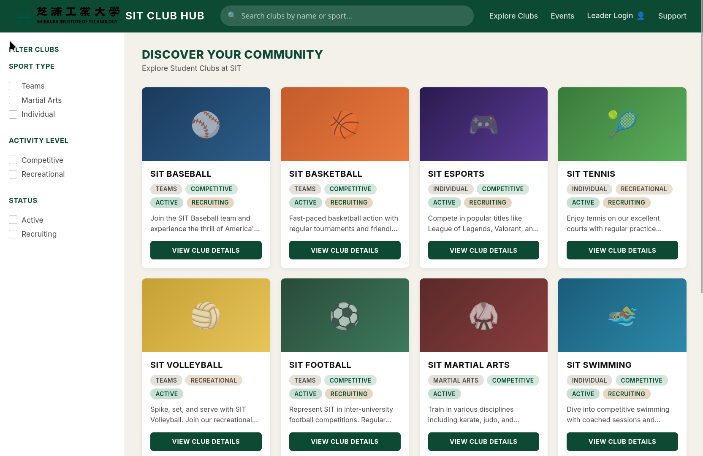

# SIT Club Hub

A student club discovery platform for Shibaura Institute of Technology. Browse, search, and filter sports clubs at SIT.

## Tech Stack

- **Hosting:** Firebase Hosting (static)
- **Backend:** Firebase Cloud Functions (Python)
- **Database:** Firestore
- **Frontend:** Vanilla HTML / CSS / JS

## Project Structure

```
public/
├── index.html          Main entry — navbar, sidebar, club grid layout
├── 404.html            Branded 404 page
├── css/style.css       Full design system (colors, typography, grid, responsive)
└── js/app.js           Club data, filter logic, search, mobile sidebar toggle
functions/
├── main.py             Cloud Functions entry point (Python)
└── requirements.txt
```

## Design System

The UI follows the spec in [DESIGN.md](DESIGN.md).

| Token | Value |
|---|---|
| Primary | `#0C4A34` |
| Accent | `#D2B48C` / `#E6D7C3` |
| Background | `#F4F1EA` |
| Cards | `#FFFFFF` |
| Text | `#111111` / `#4A4A4A` |
| Font | Inter, system sans-serif |

## Features

- **10 club cards** with gradient sport icons, tags, and descriptions
- **Sidebar filters** — Sport Type, Activity Level, Status checkboxes
- **Search bar** — filters by club name, description, or sport type
- **Responsive** — 4-column grid → 3 (tablet) → 2/1 (mobile). Filters collapse to drawer on mobile.
- **Typos fixed** — "SIT Esports", clean descriptions on all cards

## Screenshot


